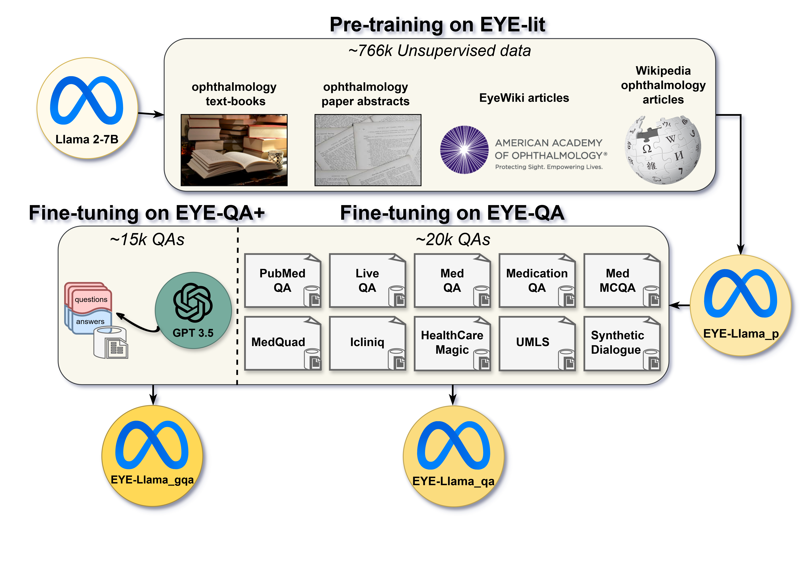
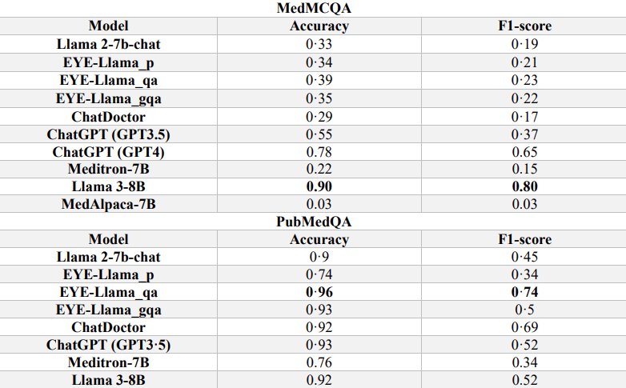
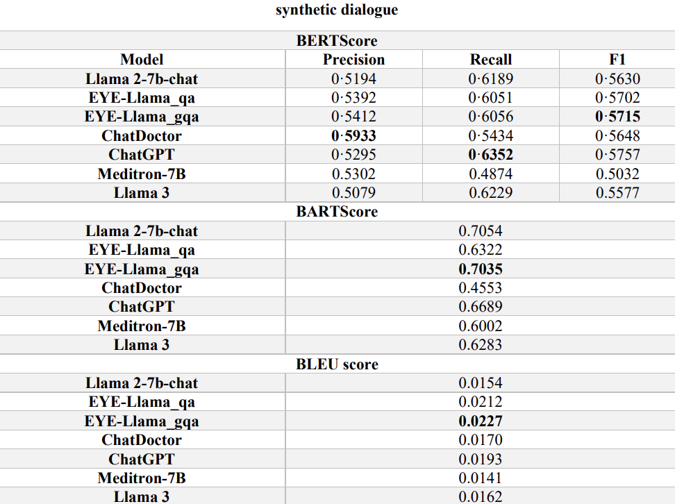
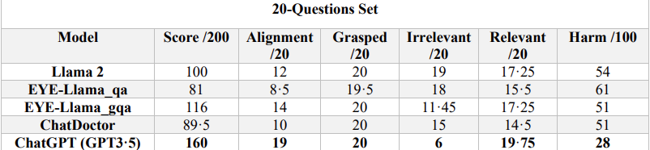

# Eye_question_answering_project
This GitHub repository hosts “Eye-Llama”, a specialized large language model tailored for the field of ophthalmology. Our research demonstrates that for medical subspecialty large language models (LLMs), an effective approach is to first pretrain them with a domain-specific corpus, followed by fine-tuning with a dataset that includes instructions.



We have made available the pretrained model, EYE-Llama_p, along with the fine-tuned models, EYE-Llama_qa and EYE-Llama_gqa. These models have exhibited significant improvements over the Llama 2 model and have outperformed ChatDoctor in various evaluations.
| Model | Link | 
| -------- | -------- |
| EYE-Llama_p    | [https://huggingface.co/QIAIUNCC/EYE-Llama_p](https://huggingface.co/QIAIUNCC/EYE-Llama_p) |
| EYE-Llama_qa    | [https://huggingface.co/QIAIUNCC/EYE-Llama_qa](https://huggingface.co/QIAIUNCC/EYE-Llama_qa)     |
| EYE-Llama_gqa    | [https://huggingface.co/QIAIUNCC/EYE-Llama_gqa](https://huggingface.co/QIAIUNCC/EYE-Llama_gqa)     |


In addition, EYE-lit and EYE-QA+ datasets have been made available at:
| Dataset  | Link | 
| -------- | -------- |
| EYE-lit    | [QIAIUNCC/EYE-lit](https://huggingface.co/datasets/QIAIUNCC/EYE-lit)     | 
| EYE-QA+    | [QIAIUNCC/EYE-QA-PLUS](https://huggingface.co/datasets/QIAIUNCC/EYE-QA-PLUS)     | 

# Training
The training process can be divided as two phases: pretrain and fine-tuning.

### pre-training
The script for pretraining:
```bash
deepspeed Pre-train.py --deepspeed ds_config.json --model_name_or_path meta-llama/Llama-2-7b-chat-hf \
    --per_device_train_batch_size 64 \
    --per_device_eval_batch_size 64 \
    --do_train \
    --do_eval \
    --num_train_epochs=10 \
    --logging_steps=1 \
    --save_steps=400 \
    --overwrite_output_dir \
    --output_dir path/to/output/dir \
    --low_cpu_mem_usage --preprocessing_num_workers 5 \
    --learning_rate 2e-4 \
    --weight_decay 1e-3 \
    --gradient_accumulation_steps 2 \
    --block_size 512 \
    --warmup_steps 600 \
    --save_total_limit 10 \
    --metric_for_best_model "eval_loss" \
    --lr_scheduler_type "cosine" \
    --logging_dir path/to/logging/dir \
    --load_best_model_at_end \
    --evaluation_strategy "steps" \
    --eval_steps 400 \
    --dataloader_num_workers 4 \
    --max_grad_norm 1.0
```

### SFT
The script for fine-tuning:

```bash
deepspeed SFT.py --deepspeed ds_config.json \
    --model_name_or_path path/to/pretrained/model \
    --data_path path/to/data \
    --per_device_train_batch_size 64 \
    --per_device_eval_batch_size 64 \
    --do_train \
    --do_eval \
    --num_train_epochs=40 \
    --logging_steps=1 \
    --save_steps=100 \
    --overwrite_output_dir \
    --output_dir path/to/output/dir \
    --learning_rate 2e-4 \
    --weight_decay 1e-3 \
    --gradient_accumulation_steps 2 \
    --warmup_steps 1000 \
    --save_total_limit 10 \
    --metric_for_best_model "eval_loss" \
    --lr_scheduler_type "cosine" \
    --logging_dir path/to/logging/dir \
    --load_best_model_at_end \
    --evaluation_strategy "steps" \
    --eval_steps 100 \
    --dataloader_num_workers 4 \
    --max_grad_norm 1.0
```

# Results
#### MedMCQA test set ([available at Huggingface](https://huggingface.co/datasets/QIAIUNCC/EYE-MedMCQA-test)) and PubMedQA test set ([available at Huggingface](https://huggingface.co/datasets/QIAIUNCC/EYE-PubMedQA-test))

#### Samples of Synthetic dialogues set ([available at Huggingface](https://huggingface.co/datasets/QIAIUNCC/synthetic_dialogues))

#### 20-Question test set ([available at Huggingface](https://huggingface.co/datasets/QIAIUNCC/EYE-20-Question-test))

